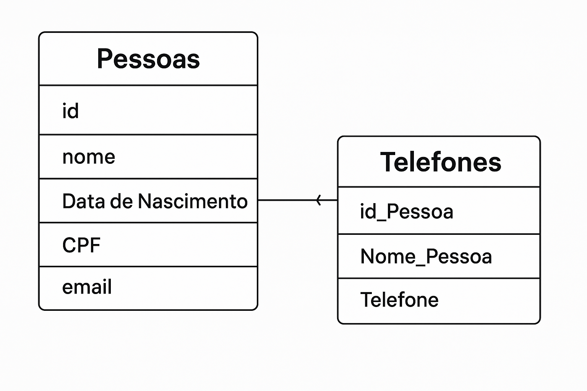

# ☎️ Lista Telefonica

Este projeto foi desenvolvido em C como parte da disciplina de Algoritmos e consiste na implementação de uma lista telefônica funcional e persistente. O sistema permite o cadastro, consulta, edição e exclusão de pessoas e seus respectivos telefones, garantindo organização e integridade dos dados por meio de armazenamento permanente. O objetivo é exercitar conceitos fundamentais da linguagem C, como manipulação de arquivos, ponteiros, estruturas e modularização.

---
## 🚀 Tecnologias Utilizadas

---

## 🗂️ Estrutura de Dados (MER)

A estrutura do projeto é baseada em duas tabelas principais — **Pessoas** e **Telefones** — com relacionamento de **um para muitos**, onde uma pessoa pode ter vários telefones, mas cada telefone pertence a apenas uma pessoa.

### 📊 Diagrama MER

